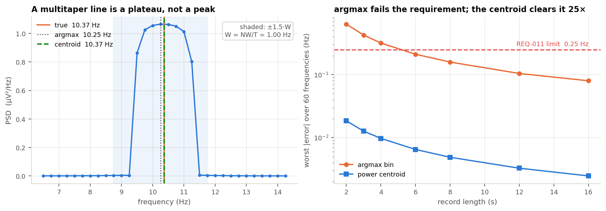
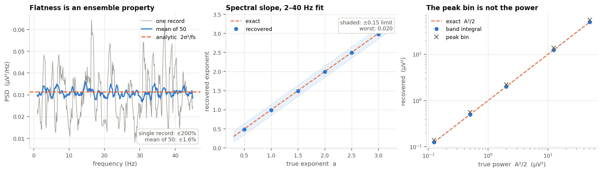
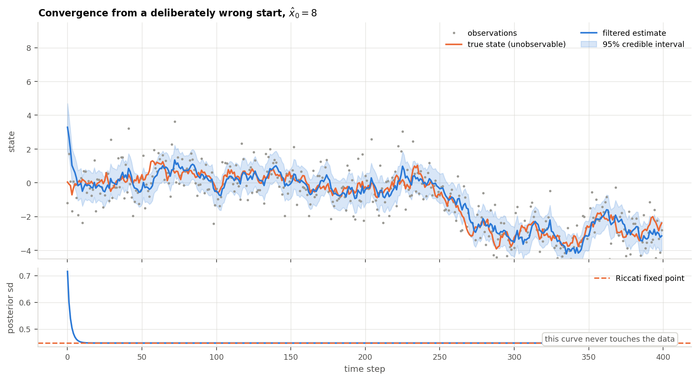
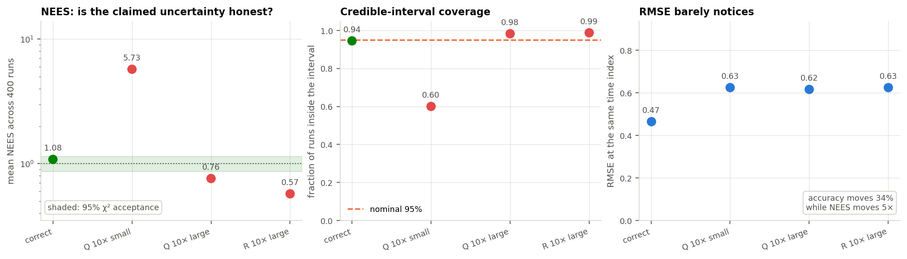
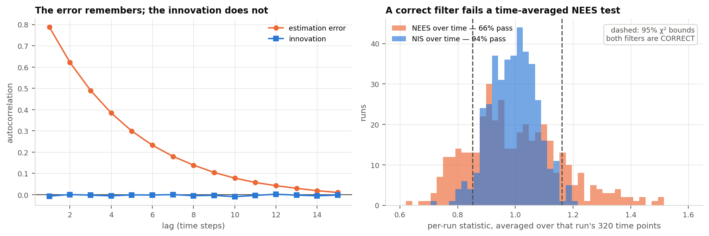
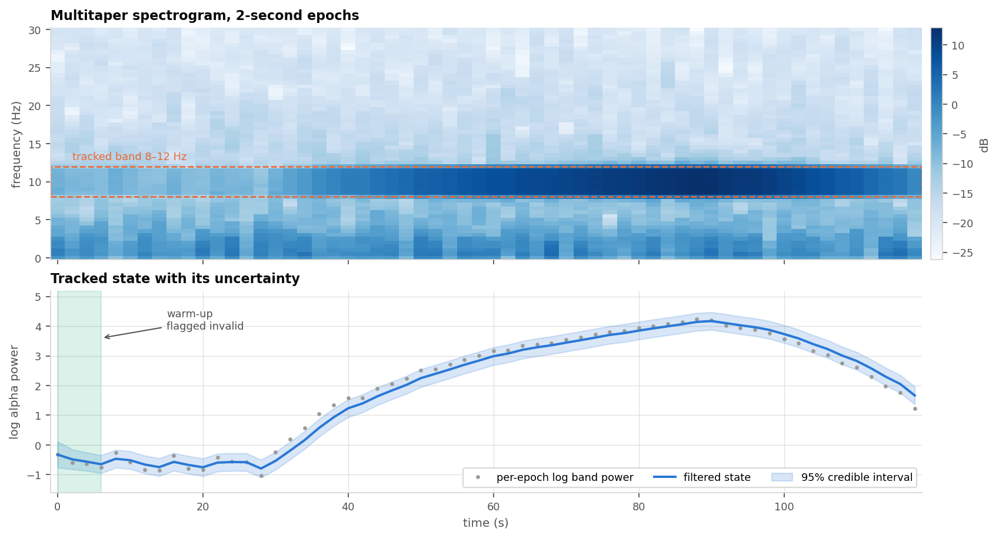
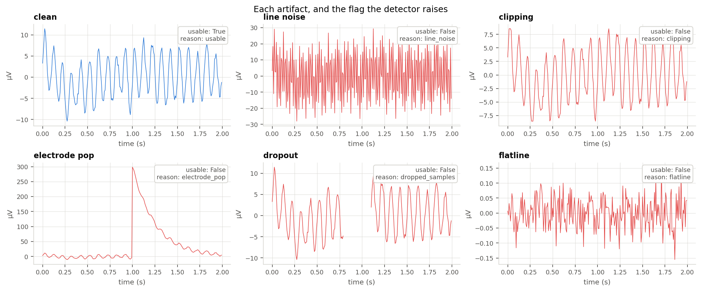
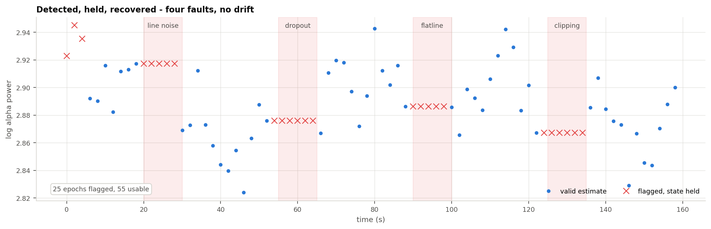

# Verification report

What was claimed, what was measured, and whether the two agree.

This is the narrative companion to [`requirements.md`](../requirements.md), which holds the
formal acceptance criteria, and to the test suite, which enforces them on every push. It
exists because a passing suite tells a reader *that* something was checked and not *what
was expected, why that was the right expectation, or how much margin there is*.

Every figure below is regenerated from seeded synthetic signals by a committed script:

```bash
pip install -e ".[dev,docs]"
python workbooks/make_figures.py
```

No download, no cached data, no network. The step-by-step derivations behind each section
are in [`workbooks/`](../workbooks) as notebooks.

> **Scope.** A demonstration core exercised on synthetic signals with analytically known
> answers. Not a medical device, not clinically validated, not fit for patient use.

---

## Summary

| Area | Requirements | Status |
|---|---|---|
| Input contracts | REQ-001 … REQ-002 | 2 / 2 verified |
| Spectral estimation | REQ-010 … REQ-020 | 11 / 11 verified |
| Recursive state estimation | REQ-030 … REQ-037 | 8 / 8 verified |
| Streaming | REQ-050 … REQ-056 | 7 / 7 verified |
| Signal quality and artifacts | REQ-060 … REQ-067 | 8 / 8 verified |
| Verification infrastructure | REQ-040 … REQ-041 | 2 / 2 verified |

**167 tests, 38 of 38 requirements with at least one test.** The requirement-to-test map is
generated from the source, not maintained by hand:
[`traceability-matrix.md`](traceability-matrix.md).

**Three requirements were corrected before any test was written against them**, because the
tolerances in the first draft were measured and found to be unsatisfiable or statistically
fragile. Those corrections are the most informative content in
[`design-decisions.md`](design-decisions.md).

---

## 1. Spectral estimation

### 1.1 Peak frequency — why the answer is not the largest bin

**Expectation.** Recover the frequency of a sinusoid to within ±0.25 Hz (REQ-011).

The obvious implementation is `argmax` of the PSD, and the obvious justification is that
the worst case is half a frequency bin. **Both are wrong**, and this is the single most
instructive result in the report.



**What the left panel shows.** Averaging `K` spectrally concentrated tapers does not produce
a *peak* over a spectral line. It produces a **flat-topped plateau** roughly `2W` wide,
where `W = NW/T` is the analysis half-bandwidth. Inside a plateau the location of the
maximum is decided by taper ripple, not by the signal.

**Consequence.** The argmax error scales with `W`, not with the bin width — so zero-padding
does not help, because finer bins sample a flat top more densely without making it less
flat. The right panel shows argmax **failing the requirement outright** at record lengths
of 5 s and below: 0.32 Hz at 4 s, which is larger than one full bin.

**What works.** The plateau is symmetric about the true frequency, so its *first moment* is
correct where its maximum is not. A power-weighted centroid over `±1.5·W` gives:

| Record | Bin width | argmax error | Centroid error |
|---|---|---|---|
| 2 s | 0.500 Hz | 0.621 Hz | 0.018 Hz |
| 4 s | 0.250 Hz | **0.316 Hz** ✗ | 0.0096 Hz |
| 8 s | 0.125 Hz | 0.160 Hz | 0.0049 Hz |
| 16 s | 0.062 Hz | 0.080 Hz | 0.0025 Hz |

**Verdict: PASS with 26× margin.** The band is shared with the power integral below, so one
helper returns it and the two results cannot disagree.

### 1.2 Three oracles with closed-form answers



**Left — white-noise flatness (REQ-015).** The first draft required a single record's PSD to
be flat within ±10% bin-to-bin. **No correct multitaper implementation can do that.** The
per-bin relative standard deviation is `1/√K` = 38% by design, and measurement gives
200–236% regardless of record length — a longer record buys more bins at the same scatter,
not smoother bins. Flatness is a property of the *expected* spectrum, so the requirement is
stated over an ensemble of 50 records and compared against the analytic level `2σ²/fs`
rather than the record's own mean. That is strictly stronger: it checks flatness **and**
absolute normalisation in one assertion. **Measured 1.6% against a ±10% bound.**

**Middle — spectral slope (REQ-016).** `1/f^a` noise, log-log least squares over 2–40 Hz.
The fit excludes the lowest bins for three independent reasons: `log(0)` is undefined; bins
below `2W` are contaminated by leakage of any residual mean through the taper main lobe
(fitting from the first bin breaches the limit for shallow exponents - worst +0.366 at
a = 0.5 over six seeds, against +0.03 fitting from 2 Hz); and an unbounded `f^-a` is not a
realisable process, so the lowest bins of a real record do not follow the law anyway.
**Worst error 0.083 against +/-0.15.**

**Right — signal power (REQ-012).** The peak PSD bin is not the signal power, and no
tolerance makes it so: the bin has units of power *per hertz* and depends on `W`, while the
line power `A²/2` has units of power. They are different quantities. The grey crosses are
the peak bin; the blue circles are the integral over the analysis band. **Band integral
within 0.8%; the peak bin is wrong by a factor that changes with record length.**

**Not plotted — Parseval (REQ-013).** The first draft compared the PSD integral to the
time-domain variance of white noise within ±2%. That measures the sampling error of a
variance estimate, not the normalisation: 2.76% at 4 s, so the requirement failed while the
code was correct. Restated against the *taper-weighted* mean square it is an exact identity.
**Measured agreement 2.2 × 10⁻¹⁶ — machine precision.** This is the test that catches any
regression in the taper normalisation or the one-sided doubling rule.

---

## 2. Recursive state estimation

### 2.1 Tracking, and a variance schedule that never touches the data

**Expectation.** Recover a latent trajectory with RMSE at least 2× better than the raw
observations (REQ-032), and converge from a deliberately poor initialisation (REQ-036).



The filter is started at `x̂₀ = 8` when the truth is near 0. It converges within roughly 25
steps and tracks thereafter.

**The lower panel is the more interesting one.** The posterior standard deviation falls to a
fixed value and stays there — and that curve is computed **without reference to any
observation**. The variance recursion involves only `A`, `Q`, `C` and `R`, so a filter's
entire uncertainty schedule is knowable before a single sample is collected. Its limit is
the Riccati fixed point, which for `A = C = 1` solves `p² − Qp − QR = 0` in closed form.

That is what the streaming warm-up criterion is built on: "has the filter converged" is
answerable from the model alone, so the flag is self-calibrating rather than a hand-picked
epoch count that silently becomes wrong when someone retunes `Q`.

**Verdict: PASS.** Steady-state variance matches the closed form to `rtol = 1e-6`, from any
initial value.

### 2.2 Is the reported uncertainty honest?

**Expectation.** The filter emits a guess *and a confidence*. RMSE audits the guess.
**NEES audits the confidence** (REQ-035), and credible-interval coverage audits it a second,
independent way (REQ-033).



Four filters on identical data: one correct, three knowably wrong (REQ-037 — a diagnostic
suite that only ever reports PASS is indistinguishable from a suite of `assert True`).

**Read the first and third panels against each other.** RMSE moves from 0.47 to 0.63 — about
34% worse, the kind of degradation that is easy to miss. NEES moves by a factor of **5**
relative to the correct filter, and spans **10×** across the four.

The `Q 10× too small` case is the dangerous one: the filter believes the state can barely
move, so it under-weights new data and its posterior variance collapses to a confidence it
has not earned. **The trajectory still looks plausible. The error bars are a lie.** Coverage
confirms it independently — the true state falls inside the nominal 95% interval only 60% of
the time.

The two over-smoothed filters fail in the opposite direction: coverage of 98–99% is not
"better than 95%", it means the intervals are too wide to be useful.

**Verdict: PASS.** Correct filter NEES 1.08 inside [0.866, 1.143]; coverage 0.94 against
0.95 ± 0.03. All three broken filters are rejected.

### 2.3 Why NEES is averaged across runs and NIS over time

This is the subtlest result here, and it is a trap that produces a test which passes on the
seed it was written with and fails intermittently afterwards.



**Left.** Under a correct model the *innovation* sequence is white **by construction** — an
optimal filter has already extracted everything predictable from the past, so what is left
is unpredictable. The *estimation error* is not: the filter carries error forward through
the state, giving a lag-1 autocorrelation of about 0.79.

**Right.** Both histograms come from **correct** filters. Averaging each run's statistic over
its own 320 time points and testing against the chi-square bounds:

- **NIS over time: 94% pass** — correct, because the samples are independent.
- **NEES over time: 66% pass** — mis-calibrated. The bounds assume 320 independent samples;
  autocorrelation means the effective number is far smaller, so the bounds are far too tight.

**A time-averaged NEES test rejects a third of correct filters.** The fix is aggregation, not
tolerance: average NEES **across independent runs at one time index**, where the runs really
are independent.

This also explains why the two diagnostics are not interchangeable. NEES needs the true
state and is simulation-only. NIS is built from the innovation and its variance alone — both
of which the filter already computes — and is therefore the one that works on a real
recording where no ground truth exists.

The API enforces the distinction structurally: `nees_across_runs` takes 2-D
`(n_runs, n_samples)` arrays and a required keyword-only `time_index`, so averaging over
time is not expressible, and `truth` is its first positional parameter with no default, so
it cannot be reached without ground truth in hand.

---

## 3. Streaming

**Expectation.** Chunked output identical to batch within `rtol = 1e-9` (REQ-051); output at
time `t` unchanged when future samples are appended (REQ-052); warm-up flagged (REQ-053);
retained state constant in record length (REQ-054).



Raw samples in, a tracked state with an interval out. The record's alpha amplitude rises and
then falls; the spectrogram shows the 8–12 Hz band responding, and the filtered state
follows it with a credible interval that widens where the per-epoch estimates disagree.

**Equivalence and causality both come out bitwise identical**, not merely inside the
tolerance the requirement allows. That is a property of the design rather than luck: the
batch path constructs the estimator and calls `update()` once, so there is a single
implementation and no second code path to drift. Equivalence is checked at chunk sizes 1, 7,
128, 257, 1024 and 5000 — a chunk size of 1 is the strictest case, since every sample
arrives separately.

**Causality is structural, not merely tested.** The buffer is drained as epochs complete, so
the samples an emitted epoch was computed from no longer exist. There is no mechanism by
which a later chunk could revise it.

**The design decision this forced.** There is deliberately no band-pass filter in the
pipeline. The conventional offline choice is zero-phase — filter forwards, then backwards,
so there is no group delay — and **that is look-ahead**. It would break causality while
reading as one innocent library call in review, and the filtered signal would look *better*.
The filter that looks best offline is the one that is forbidden online.

**Warm-up (shaded).** Flagged, not suppressed. The numbers are present and finite so a
caller may plot them; the flag prevents them being mistaken for a converged estimate.
Validity latches rather than flickering, because the posterior variance decreases
monotonically to its fixed point.

**Verdict: PASS**, all six streaming requirements.

---

## 4. Signal quality and artifacts

**Expectation.** Detect the contaminants that are loud enough to change a spectral estimate,
and satisfy a three-part contract for each: *detected*, *held*, *recovered*
(REQ-060 … REQ-067).



Five detectors, each firing on its own fault and on nothing else. A clean epoch raises no
flag — the control that matters most, since a detector that fires on good signal is
worthless however well it performs on bad.

### Detection is a third of the job

The part that is easy to skip is **holding the state**. An estimator that flags a fault and
then feeds the contaminated observation to its filter is still wrong, and stays wrong after
the fault has gone. Measured on a 10-second flatline, with the same filter and the same
data, gated against ungated:

| | worst excursion | time to return to baseline after the fault clears |
|---|---|---|
| state held (gated) | **0.07** | **0.0 s** |
| artifact absorbed | 11.30 | **14.0 s** |

The fault lasts 10 seconds; the ungated estimate is wrong for 24. That is the filter doing
its job — its gain is a precision-weighted compromise, so it absorbs the bad observations
gradually and must be dragged back just as gradually. **The cost of absorbing an artifact is
its duration plus the filter's settling time**, and the settling time is by design much
longer than one epoch.

Because the gated path never offers the observation to the filter, there is nothing to
unwind and recovery is immediate.



Four faults on one record. Each flagged run is perfectly horizontal — that is not the filter
smoothing through the fault, it is the filter not being asked. Drift across the whole record
is **0.018** in log power, so four faults cost nothing cumulatively.

### Thresholds are in robust units, and that decides whether the detector works

Every amplitude threshold is scaled by the median absolute deviation, not the standard
deviation. This is not a stylistic preference. Measured on an epoch whose own amplitude is
about 6 µV:

| epoch | std | robust (MAD) | max jump | jump/std | jump/MAD |
|---|---|---|---|---|---|
| clean | 4.67 | 5.89 | 5.3 | 1.13 | 0.89 |
| + 300 µV pop | 67.27 | 16.02 | 302.1 | **4.49** | 18.85 |
| + 900 µV pop | 199.87 | 27.62 | 902.1 | **4.51** | 32.66 |

Tripling the artifact leaves `jump/std` unchanged, because the standard deviation of an
epoch containing a pop is dominated by the pop: **the statistic used to find the artifact is
corrupted by the artifact.** A detector set at 8 standard deviations would miss a 900 µV
excursion entirely. MAD has a 50% breakdown point, so `jump/MAD` scales as a yardstick
should and the same threshold catches both.

### What is not detected

Specifically, because a vague limitation is not a limitation. Three contaminants at roughly
signal amplitude, all of which pass as usable:

| contaminant | detected | effect on measured alpha power |
|---|---|---|
| slow drift, 0.3 Hz 8 µV | no | 1.01× |
| muscle-band noise, 6 µV | no | 1.20× |
| tone inside the band, 5 µV | no | **1.48×** |

The third changes the measurement by half and is reported as a confident estimate with a
normal credible interval. This is not fixable by lowering thresholds: at that amplitude the
contaminant and the signal are the same thing as far as a single-channel amplitude or
spectral test is concerned. Separating them needs information this estimator does not have —
a second channel, a reference, or a model of the contaminant.

So the claim stays narrow and checkable: **these five loud faults are caught, and the
estimator refuses to produce a confident number while one is present.**

Derivation in [`workbooks/04_artifact_robustness.ipynb`](../workbooks/04_artifact_robustness.ipynb).

---

## Limitations

Stated because a verification report that lists only successes is not evidence.

- **This is not a regulated development process.** It borrows the shape of one — numbered
  requirements, traced tests, recorded rationale — with no quality management system behind
  it, no design history file and no independent reviewer. The claim is that the author knows
  what such evidence looks like and can produce it, which is narrower than having worked
  under it.
- **Synthetic signals only.** Every result here is on generated data with known answers.
  Nothing has been run against a clinical recording, and agreement with any commercial
  monitor is unmeasured.
- **Multitaper dynamic range.** On a spectrum spanning more than roughly 70 dB inside the
  analysis band, taper sidelobe leakage forms a pedestal under the high-frequency bins and
  flattens a slope fit. Adaptive (Thomson eigenvalue) weighting would improve this and is not
  implemented. Diagnosed by comparing against an untapered periodogram, which recovers the
  slope correctly — localising the cause to the input's dynamic range rather than the
  estimator.
- **Scalar state only.** The filter is one-dimensional. The diagnostics are written so the
  scalar case reads as `d = 1` of the general rule, but the vector filter is not implemented.
- **Requirement coverage is complete; code coverage is not measured.** Every requirement has
  a test. That is not the same as every branch being exercised.
- **Artifact handling is narrow by design.** Five loud faults are caught (section 4). A
  contaminant at roughly signal amplitude — slow drift, muscle activity, a tone inside the
  analysis band — is not detected and is absorbed silently. Mains frequency is configuration
  rather than detection, because a two-second epoch does not reliably distinguish 50 from
  60 Hz.

  The fault with a safety argument behind it is signal loss. A disconnected electrode gives
  a flat trace with almost no band power, and low band power is also what the deepest
  physiological state looks like — so an estimator that reports the two identically claims
  maximum depth precisely when it has no input. Such an epoch is reported as a **distinct
  state rather than a value on the measurement scale** (REQ-056, REQ-065), and the filter is
  not advanced by it.

  An earlier revision got this wrong, reporting `valid = True` with a credible interval
  exactly as tight as on live signal. It was found by external review, not by the suite.
